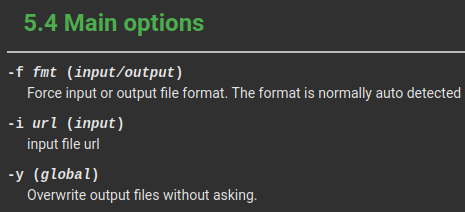

# FFmpeg command line basics

[FFmpeg](https://en.wikipedia.org/wiki/FFmpeg) is a free, open source, video media conversion tool.

FFmpeg has three classes of command line option:

- global options
- options specific to an input source
- options specific to an output destination

Quoting directly from [FFmpeg's documentation](https://ffmpeg.org//ffmpeg-all.html#Synopsis), the format of a generic FFmpeg command line is:

> *ffmpeg [global_options] {[input_file_options] -i input_url} ... {[output_file_options] output_url} ...*

## Option types

Global options include generic options like getting help, and setting the logging level.

Input options include telling FFmpeg that an input is of a specific format where FFmpeg cannot guess the format from the input source, and setting an input source to repeat.

Output options include setting the encoding parameters for an output destination, and telling FFmpeg to output in a specific format where FFmpeg cannot guess the format from the output filename.

Some options can be used in multiple contexts. In the examples I gave above I say it is possible to define the format of an input source and output destination. Both use the `-f <format>` option. Therefore it is vital that the option is given in the correct location in the command line.

## Which option is which type

All of the generic command line options listed in [this section of FFmpeg's documentation](https://ffmpeg.org//ffmpeg-all.html#Generic-options) are global options.

Every other command line option in [FFmpeg's documentation](https://ffmpeg.org//ffmpeg-all.html#Main-options) includes a parenthesised list of the contexts the command can be used in.



It is important to read the FFmpeg documentation for every command line option to understand whether the option is a global option, an input option, or an output option. And it is important to understand the context in which the command line option is being used, in order to put the option in the right place in the command line.

## FFmpeg command line generators

If you are using a external library to create the FFmpeg command line then it is important that you also understand how that library accepts options, in order to create the command line correctly.

### Jaffree

For instance, the popular [Jaffree](https://github.com/kokorin/Jaffree) Java FFmpeg command line wrapper has three ways to set command line options.

- global options are added using methods on the [FFmpeg class](https://javadoc.io/doc/com.github.kokorin.jaffree/jaffree/latest/com/github/kokorin/jaffree/ffmpeg/FFmpeg.html)
- input options are added using methods on an implementation of the [Input interface](https://javadoc.io/doc/com.github.kokorin.jaffree/jaffree/latest/com/github/kokorin/jaffree/ffmpeg/Input.html) via the inheritance through the [BaseInput class](https://javadoc.io/doc/com.github.kokorin.jaffree/jaffree/latest/com/github/kokorin/jaffree/ffmpeg/BaseInput.html) from the [BaseInOut class](https://javadoc.io/doc/com.github.kokorin.jaffree/jaffree/latest/com/github/kokorin/jaffree/ffmpeg/BaseInOut.html)
- output options are added using methods on an implementation of the [Output interface](https://javadoc.io/doc/com.github.kokorin.jaffree/jaffree/latest/com/github/kokorin/jaffree/ffmpeg/Output.html) via the inheritance through the [BaseOutput class](https://javadoc.io/doc/com.github.kokorin.jaffree/jaffree/latest/com/github/kokorin/jaffree/ffmpeg/BaseOutput.html) from the [BaseInOut class](https://javadoc.io/doc/com.github.kokorin.jaffree/jaffree/latest/com/github/kokorin/jaffree/ffmpeg/BaseInOut.html)

All three include `addArgument(...)` and `addArguments(...)` methods, which can add generic command line options to the FFmpeg command line. If you don't use the correct `addArgument(...)` method then the command line option may appear in the wrong place in the command line causing FFmpeg to not do what you expected.

In addition, the implementations of the `Input` and `Output` interfaces include specific methods for setting options which are available for that class of command line option.

### Jaffree example

As an small example, this class will use FFmpeg to read the first 5 seconds of an input file and write two output files; a `.mov` video file with h.264 encoded video and PCM audio at a sample rate of 48kHz, and a `.wav` audio file with the PCM audio at a sample rate of 44.1kHz.

```java
public class SimpleEncode implements Runnable {

    public static void main(final String[] args) {
        final Runnable app = new SimpleEncode();
        app.run();
    }

    @Override
    public void run() {
        FFmpeg.atPath(Path.of("/home/user/bin/"))
                .addArguments("-loglevel", "debug")
                .setOverwriteOutput(true)
                .addInput(getInput())
                .addOutput(getOutputVideo())
                .addOutput(getOutputAudio())
                .execute();
    }

    private Input getInput() {
        return UrlInput.fromUrl("input.mp4")
                .setDuration(5000);
    }

    private Output getOutputVideo() {
        return UrlOutput.toUrl("output.mov")
                .setCodec("v", "libx264")
                .addArguments("-profile:v", "main")
                .addArguments("-level:v", "4.1")
                .addArguments("-crf:v", "18")
                .setCodec("a", "pcm_s16le")
                .addArguments("-ar:a", "48000")
                .addMap(0, "v:0")
                .addMap(0, "a:0");
    }

    private Output getOutputAudio() {
        return UrlOutput.toUrl("output.wav")
                .disableStream(StreamType.VIDEO)
                .setCodec("a", "pcm_s16le")
                .addArguments("-ar:a", "44100")
                .addMap(0, "a:0");
    }

}
```

Complete class is available [here](SimpleEncode.java).

The final command line, as calculated by the Jaffree library but with some added comments, looks like this:

```bash
ffmpeg \
`: # Jaffree's default log level` \
 -loglevel 32 \
`: # input file options and the input file` \
 -t 5.000 -i input.mp4 \
`: # global options` \
 -y -loglevel debug \
`: # first output file options and the first output file` \
 -c:v libx264 -c:a pcm_s16le -profile:v main -level:v 4.1 \
 -crf:v 18 -ar:a 48000 -map 0:v:0 -map 0:a:0 \
 output.mov \
`: # second output file options and the second output file` \
 -c:a pcm_s16le -ar:a 44100 -vn -map 0:a:0 \
 output.wav
```

Personally, I'd prefer that Jaffree output the global options first because that's what the FFmpeg specifications say. But, since global options can appear anywhere in the command line, it doesn't matter.
