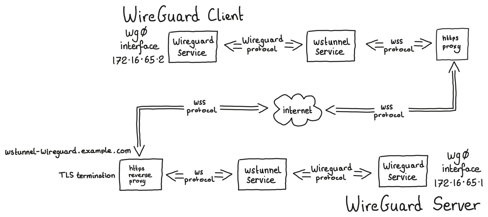

# WSTunnel and Wireguard

## Overview

In this guide I'm going to demonstrate setting up a [WSTunnel](https://github.com/erebe/wstunnel/) web-socket tunnel, and running a [WireGuard](https://www.wireguard.com/) VPN over that tunnel.

For this guide the requirement is to make a VPN between two locations:

* a network location which is behind a corporate firewall and has no UDP or TCP egress from the corporate network other than via an HTTP/HTTPS proxy
* a network location which can accept incoming incoming connections via an HTTPS reverse-proxy

There are many purposes for a VPN like this. One example could be to transfer business data between a remote system and the corporate headquarters.

I've seen some guides which focus on configuring a [WireGuard](https://www.wireguard.com/) VPN and then tack on using a [WSTunnel](https://github.com/erebe/wstunnel/) web-socket tunnel to tunnel the [WireGuard](https://www.wireguard.com/) VPN at the end of the article.

For me, that is backwards, especially for this requirement.

For this guide I will start by making and testing a [WSTunnel](https://github.com/erebe/wstunnel/) web-socket tunnel and then finish with tunnelling a [WireGuard](https://www.wireguard.com/) VPN in the [WSTunnel](https://github.com/erebe/wstunnel/) web-socket tunnel.

### Ingredients

I'm going to use the following components:

* a Linux server with a kernel that supports [WireGuard](https://www.wireguard.com/) on the corporate network. I'll need root access, which I will achieve using `sudo`. This guide will call this server the `WireGuird client`.
* the corporate network's HTTP/HTTPS forward proxy
* an instance of [Traefik](https://traefik.io/traefik/) which is publicly available running in a kubernetes cluster
* a Linux server with a kernel that supports [WireGuard](https://www.wireguard.com/) on the other network behind the Treafik reverse-proxy. I'll need root access, which I will achieve using `sudo`. This guide will call this server the `WireGuird server`.
* [WSTunnel](https://github.com/erebe/wstunnel/) installed on both the `WireGuird client` and the `WireGuird server`
* [WSTunnel](https://github.com/erebe/wstunnel/) tools `wg` and `wg-quick` installed on both the `WireGuird client` and the `WireGuird server`
* [curl](https://curl.se/) - for downloading software and testing HTTP/HTTPS connections
* [ncat](https://nmap.org/ncat/) (or any other [netcat](https://en.wikipedia.org/wiki/Netcat) variant) - for testing
* [tcpdump](https://www.tcpdump.org/) - for testing

### Network topology



## Install test tools

I gained shell access to both of the `WireGuird client` and the `WireGuird server` Linux servers and installed the tools `curl`, `netcat`, and `tcpdump` - for example, on Ubuntu 22.04 the commands I used are:

```console
sudo apt update
sudo apt install curl ncat tcpdump
```

## Configure Traefik ingress

I'm going to start in the bottom right of the network topology diagram by configuring [Traefik](https://traefik.io/traefik/), and then work towards each of the two ends. This is the easiest way to test that every component works before I continue to the next component.

[Traefik](https://traefik.io/traefik/) is a reverse-proxy service, accepting incoming https connections from the Internet. [Traefik](https://traefik.io/traefik/) will be terminating TLS with a trusted certificate and routing the incoming web-socket connection onto the [WSTunnel](https://github.com/erebe/wstunnel/) server.

This guide assumes that [Traefik](https://traefik.io/traefik/) is running in a [Kubernetes](https://kubernetes.io/) cluster, and the [Traefik](https://traefik.io/traefik/) `websecure` `entrypoint` is publicly accessible from the Internet via some form of `LoadBalancer`.

### Traefik routing to Services with ExternalNames

[Traefik](https://traefik.io/traefik/) must allow routing to `Services` of `type` `ExternalName`. As described [in this post](https://community.traefik.io/t/allowexternalnameservices-parameter-not-working-well-in-helm-chart/11653/3), in [Traefik](https://traefik.io/traefik/) version 2 my [Traefik](https://traefik.io/traefik/) `Deployment` had to be updated by adding the following into the [Traefik](https://traefik.io/traefik/) `container`'s `args`, and restarting the deployment.

```console
            - '--providers.kubernetesingress.allowemptyservices=true'
            - '--providers.kubernetesingress.allowexternalnameservices=true'
            - '--providers.kubernetescrd.allowemptyservices=true'
            - '--providers.kubernetescrd.allowexternalnameservices=true'
```

### Traefik manifest

The example [Kubernetes](https://kubernetes.io/) manifest below will create:

* a new `Namespace` in the [Kubernetes](https://kubernetes.io/) cluster
* a new `Service` in the `Namespace` with an `ExternalName` pointing to the `WireGuard server` Linux server
* a [Traefik](https://traefik.io/traefik/) `ServersTransport` in the `Namespace` which configurs how [Traefik](https://traefik.io/traefik/) will connect to the `Service`
* a [Traefik](https://traefik.io/traefik/) `IngressRoute` in the `Namespace` routing all connections to the configured host `wstunnel-wireguard.example.com` through to the [Kubernetes](https://kubernetes.io/) `Service`

For this example I'm using a TLS certificate which is already stored in the namespace.

```yaml
---
apiVersion: v1
kind: Namespace
metadata:
  name: wstunnel
---
apiVersion: v1
kind: Service
metadata:
  name: wstunnel
  namespace: wstunnel
spec:
  type: ExternalName
  externalName: wstunnel-wireguard.lan
---
apiVersion: traefik.containo.us/v1alpha1
kind: ServersTransport
metadata:
  name: traefik-servers-transport
  namespace: wstunnel
spec:
  serverName: "wstunnel-wireguard.lan"
  insecureSkipVerify: true
---
apiVersion: traefik.containo.us/v1alpha1
kind: IngressRoute
metadata:
  name: wstunnel-https
  namespace: wstunnel
spec:
  entryPoints:
    - websecure
  routes:
    - kind: Rule
      match: Host(`wstunnel-wireguard.example.com`)
      services:
        - kind: Service
          name: wstunnel
          namespace: wstunnel
          port: 8080
          serversTransport: traefik-servers-transport
  tls:
    secretName: wstunnel-wireguard.example.com-tls-secret
...
```

I saved that manifest and applied it to my Kubernetes cluster.

```console
kubectl config use-context <MY-KUBERNETES-CLUSTER-CONTEXT>
kubectl apply -f wstunnel-reverse-proxy.yaml
```

### Test Traefik routing

I gained shell access to the `WireGuard server` Linux server and ran `ncat` listening on port 8080, which is the port defined in the [Traefik](https://traefik.io/traefik/) `IngressRoute`.

```console
ncat -k -l 0.0.0.0 8080
```

Then I connected using HTTPS to the [Traefik](https://traefik.io/traefik/) service requesting the host I defined - in my example that is `https://wstunnel-wireguard.example.com`

I gained shell access to the `WireGuard client` Linux server and tested that it can connect to the `WireGuard server` via the corporate forward HTTP/HTTPS proxy and the [Traefik](https://traefik.io/traefik/) Service.

```console
HTTPS_PROXY=http://corporate.proxy curl -v https://wstunnel-wireguard.example.com
```

On the console of the `WireGuard server` running `ncat` behind the [Traefik](https://traefik.io/traefik/) `Service` I saw the connection attempt.

```console
GET / HTTP/1.1
Host: wstunnel-wireguard.example.com
User-Agent: curl/7.68.0
Accept: */*
X-Forwarded-For: 10.42.2.1
X-Forwarded-Host: wstunnel-wireguard.example.com
X-Forwarded-Port: 443
X-Forwarded-Proto: https
X-Forwarded-Server: traefik-65d7b75858-pgs6m
X-Real-Ip: 10.42.2.1
Accept-Encoding: gzip
```

The `curl` command will hang for a while because `ncat` will not be returning any valid HTTP response to `curl`, so I needed to stop `curl` using `CTRL-C`.

When that worked I stopped the `ncat` process with `CTRL-C`.

If I needed to debug [Traefik](https://traefik.io/traefik/) I could have added the following into the [Traefik](https://traefik.io/traefik/) `container`'s `args` and restarted the deployment.

```console
            - '--log.level=DEBUG'
```

## Install WSTunnel

I gained shell access to both the `WireGuard client` and the `WireGuard server` Linux servers and download the latest version of [WSTunnel](https://github.com/erebe/wstunnel/) from the releases page <https://github.com/erebe/wstunnel/releases> - at the time of writing it's version 4.1. I moved it into `/usr/local/bin/` and made it executable by everyone.

```console
# WireGuard client
curl -o wstunnel https://github.com/erebe/wstunnel/releases/download/v4.1/wstunnel-x64-linux

# WireGuard server
HTTPS_PROXY=http://corporate.proxy curl -o wstunnel https://github.com/erebe/wstunnel/releases/download/v4.1/wstunnel-x64-linux

sudo mv wstunnel /usr/local/bin/wstunnel
sudo chmod a+x /usr/local/bin/wstunnel
```

## Manually run a WSTunnel applications to create the tunnel between the WireGuard client and WireGuard server

I gained shell access to the `WireGuard server` Linux server and ran [WSTunnel](https://github.com/erebe/wstunnel/) as a server waiting for a client to connect.

```console
/usr/local/bin/wstunnel -v --server ws://0.0.0.0:8080 --restrictTo=127.0.0.1:51820
```

In another shell on the same the `WireGuard server` Linux server I ran `ncat` listening for UDP traffic on port 51820:

```console
ncat -u -l 127.0.0.1 51820
```

I gained shell access to the `WireGuard client` Linux server and ran [WSTunnel](https://github.com/erebe/wstunnel/) as a client connecting to the server.

```console
/usr/local/bin/wstunnel -v --udp --udpTimeoutSec -1 -L 127.0.0.1:51820:127.0.0.1:51820 -p corporate.proxy:80 wss://wstunnel-wireguard.example.com:443
```

In another shell on the same the `WireGuard client` Linux server ran `ncat` connecting to UDP port 51820:

```console
ncat -u 127.0.0.1 51820
```

I could now type a line of text into both of the the `ncat` shells on the `WireGuard client` and the `WireGuard server` and when I press the enter key the line of text appeared on the other `ncat` shell.

I can also watch the data being sent in each direction by opening another shell on the `WireGuard client` and using TCPDump.

```console
sudo tcpdump -i eno1 host corporate.proxy
```

When that worked I stopped both of the `ncat` processes and both of the `wstunnel` processes with `CTRL-C`.

## Install WSTunnel services to create the tunnel between the WireGuard client and WireGuard server

Create `systemctl` unit files to start and run the [WSTunnel](https://github.com/erebe/wstunnel/) commands.

### Install WSTunnel on WireGuard Server

I gained shell access to the `WireGuard server` Linux server and created a systemd init file `/etc/systemd/system/wstunnel.service`:

```console
cat <<EOF | sudo tee /etc/systemd/system/wstunnel.service >/dev/null
[Unit]
Description=WSTunnel server over which to tunnel WireGuard UDP VPN
After=network.target

[Service]
Type=simple
User=nobody
ExecStart=/usr/local/bin/wstunnel -v --server ws://0.0.0.0:8080 --restrictTo=127.0.0.1:51820
Restart=yes

[Install]
WantedBy=multi-user.target
EOF
```

The `ExecStart` command line on the `WireGuard server` is exactly the same as was run manually above.

I enabled and started the service:

```console
sudo systemctl enable --now wstunnel.service
```

The logs for this service can be monitored in the normal way:

```console
sudo journalctl -f -u wstunnel
```

### Install WSTunnel on WireGuard Client

I gained shell access to the `WireGuard client` Linux server and created a systemd init file `/etc/systemd/system/wstunnel.service`.

```console
cat <<EOF | sudo tee /etc/systemd/system/wstunnel.service >/dev/null
[Unit]
Description=WSTunnel client over which to tunnel WireGuard UDP VPN
After=network.target

[Service]
Type=simple
User=nobody
ExecStart=/usr/local/bin/wstunnel -v --udp --udpTimeoutSec -1 -L 127.0.0.1:51820:127.0.0.1:51820 -p corporate.proxy:80 wss://wstunnel-wireguard.example.com:443
Restart=yes

[Install]
WantedBy=multi-user.target
EOF
```

The `ExecStart` command line on the `WireGuard client` is exactly the same as was run manually above.

I enabled and started the service:

```console
sudo systemctl enable --now wstunnel.service
```

The logs for this service can be monitored in the normal way:

```console
sudo journalctl -f -u wstunnel
```

### Test WSTunnel services

The `systemctl` managed [WSTunnel](https://github.com/erebe/wstunnel/) services were tested in the same was as the manually run [WSTunnel](https://github.com/erebe/wstunnel/) above, by running `ncat` at the two ends and exchanging lines of text and by watching `tcpdump`.

## WireGuard

Create [WireGuard](https://www.wireguard.com/) keys and configuration files such that `systemctl` can start and run the [WireGuard](https://www.wireguard.com/) VPN using the [WSTunnel](https://github.com/erebe/wstunnel/).

### Install WireGuard software

I gained shell access to both the `WireGuard server` and the `WireGuard client` the Linux servers and installed the [Wireguard tools](https://www.wireguard.com/install/) - for example, on Ubuntu 22.04 the commands would be:

```console
sudo apt install wireguard
```

### Create public and private keys

I created a `private key` and a `public key` for both of the [WireGuard](https://www.wireguard.com/) servers. The `private key` should be kept private and secure. As seen on the [WireGuard quickstart guide](https://www.wireguard.com/quickstart/), the generic way to create a [WireGuard](https://www.wireguard.com/) `private key` and `public key` is to use the `wg` command.

```console
wg genkey | tee privatekey | wg pubkey > publickey
```

The `WireGuard server` and the `WireGuard client` both require their own `private key` and a `public key`. This was be done securely and privately on a completely separate server, for example:

```console
sudo bash -c "umask 077 && wg genkey | tee server-privatekey | wg pubkey > server-publickey"
sudo bash -c "umask 077 && wg genkey | tee client-privatekey | wg pubkey > client-publickey"
```

Four files will have been created.

```console
$ ls -l
-rw------- 1 root root 45 Dec 01 12:37 client-privatekey
-rw------- 1 root root 45 Dec 01 12:37 client-publickey
-rw------- 1 root root 45 Dec 01 12:37 server-privatekey
-rw------- 1 root root 45 Dec 01 12:37 server-publickey
```

When the [WireGuard](https://www.wireguard.com/) config files are created below, the `WireGuard server` config file will require the contents of the `server-privatekey` and the `client-publickey` files, and the `WireGuard client` config file will require the contents of the `client-privatekey` and the `server-publickey` files.

The contents of the files can be viewed using `sudo cat`. The contents of the `privatekey` files should be transferred securely, perhaps using copy/paste in `ssh` terminals.

```console
$ sudo cat client-publickey
Sb8BGMV0MNlSZRbtyCBC/l1DYUUmUAl1TbDOOQUApgE=
```

### WireGuard MTU

The `MTU` has been calculated based on a underlying network capable of carrying 1500 byte packets carrying `IPv4` carrying `TCP` carrying `IPv4` carrying `UDP` carrying `WireGuard` wrapped data. (1500 - 20 - 20 - 20 - 8 - 32 = 1400). If the underlying network has smaller packets, for instance if part of the link uses `PPPoE`, then I would have reduced the `MTU` as appropriate.

### WireGuard VPN network

I have picked the network `172.16.65.0/24` for the VPN between the `WireGuard client` and `WireGuard server`, with the `WireGuard server` being `172.16.65.1` and the `WireGuard client` being `172.16.65.2`. These IP address are irrespective of the IP addresses on the current Ethernet (or other) interfaces which already exist on the `WireGuard server` and the `WireGuard client`.

### Configure WireGuard server

The `WireGuard server` will listen for incoming `UDP` packets on port `51820`, and will expect a connection with the `WireGuard client`'s public key.

I gained shell access to the `WireGuard server` and created a [WireGuard](https://www.wireguard.com/) config file:

```console
sudo bash -c "umask 077 && cat <<EOF | tee /etc/wireguard/wg0.conf >/dev/null
[Interface]
Address = 172.16.65.1/24
ListenPort = 51820
PrivateKey = <server-privatekey>
MTU = 1400

[Peer]
PublicKey = <client-publickey>
AllowedIPs = 172.16.65.2/32
PersistentKeepalive = 24
EOF"
```

I securely replaced the placeholders `<server-privatekey>` and `<client-publickey>` with the contents of the files created above.

The [WireGuard](https://www.wireguard.com/) service was enabled and started.

```console
sudo systemctl enable --now wg-quick@wg0.service
```

### Configure WireGuard client

The `WireGuard client` will send WireGuard encrypted data to the 'remote' `EndPoint` - port `51820` of the `localhost` interface, which is where the [WSTunnel](https://github.com/erebe/wstunnel/) service is listening for data and transporting it to the `WireGuard server`. It will expect the [WireGuard](https://www.wireguard.com/) server at the other end to have the `WireGuard server`'s public key.

I gained shell access to the `WireGuard client` and created a [WireGuard](https://www.wireguard.com/) config file:

```console
sudo bash -c "umask 077 && cat <<EOF | tee /etc/wireguard/wg0.conf >/dev/null
[Interface]
Address = 172.16.65.2/24
PrivateKey = <client-privatekey>
MTU = 1400

[Peer]
PublicKey = <server-publickey>
Endpoint = 127.0.0.1:51820
AllowedIPs = 172.16.65.1/32
PersistentKeepalive = 25
EOF"
```

I securely replaced the placeholders `<client-privatekey>` and `<server-publickey>` with the contents of the files created above.

The [WireGuard](https://www.wireguard.com/) service was enabled and started.

```console
sudo systemctl enable --now wg-quick@wg0.service
```

### Test WireGuard VPN connection

To confirm that everything is working I checked that the `wg0` network interfaces exist, that routes have been created down the [WireGuard](https://www.wireguard.com/) VPN, and that unfragmentable ping packets up to 28 bytes less that the MTU could be exchanged between the two ends of the VPN.

On the `WireGuard client`:

```console
$ ip link list type wireguard
53457: wg0: <POINTOPOINT,NOARP,UP,LOWER_UP> mtu 1400 qdisc noqueue state UNKNOWN mode DEFAULT group default qlen 1000
    link/none

$ ip address show wg0
53457: wg0: <POINTOPOINT,NOARP,UP,LOWER_UP> mtu 1400 qdisc noqueue state UNKNOWN group default qlen 1000
    link/none
    inet 172.16.65.2/24 scope global wg0
       valid_lft forever preferred_lft forever

$ ip route list root 172.16.65.2/24
172.16.65.0/24 dev wg0 proto kernel scope link src 172.16.65.2

$ ping -c 1 -M do -s 1372 172.16.65.1
PING 172.16.65.1 (172.16.65.1) 1372(1400) bytes of data.
1380 bytes from 172.16.65.1: icmp_seq=1 ttl=64 time=14.8 ms

--- 172.16.65.1 ping statistics ---
1 packets transmitted, 1 received, 0% packet loss, time 0ms
rtt min/avg/max/mdev = 14.834/14.834/14.834/0.000 ms
```

On the `WireGuard server`:

```console
$ ip link list type wireguard
5: wg0: <POINTOPOINT,NOARP,UP,LOWER_UP> mtu 1400 qdisc noqueue state UNKNOWN mode DEFAULT group default qlen 1000
    link/none

$ ip address show wg0
5: wg0: <POINTOPOINT,NOARP,UP,LOWER_UP> mtu 1400 qdisc noqueue state UNKNOWN group default qlen 1000
    link/none
    inet 172.16.65.1/24 scope global wg0
       valid_lft forever preferred_lft forever

$ ip route list root 172.16.65.1/24
172.16.65.0/24 dev wg0 proto kernel scope link src 172.16.65.1

$ ping -c 1 -M do -s 1372 172.16.65.2
PING 172.16.65.2 (172.16.65.2) 1372(1400) bytes of data.
1380 bytes from 172.16.65.2: icmp_seq=1 ttl=64 time=13.2 ms

--- 172.16.65.2 ping statistics ---
1 packets transmitted, 1 received, 0% packet loss, time 0ms
rtt min/avg/max/mdev = 13.198/13.198/13.198/0.000 ms
```

I can also watch the data being sent in each direction by opening another shell on the `WireGuard client` and using TCPDump.

```console
sudo tcpdump -i eno1 host corporate.proxy
```

## Improvements

### Make Traefik IngressRoute more specific

Right at the start of this article I created a [Traefik](https://traefik.io/traefik/) `IngressRoute` with a `rule` which selected all connections to the `host` `wstunnel-wireguard.example.com` to be forwarded to the [WSTunnel](https://github.com/erebe/wstunnel/) service.

```yaml
  routes:
    - kind: Rule
      match: Host(`wstunnel-wireguard.example.com`)
```

[WSTunnel](https://github.com/erebe/wstunnel/) uses the path of the WebSocket to decide the destination of the tunnel.

I know that the [WSTunnel](https://github.com/erebe/wstunnel/) service on the `WireGuard server` will only be forwarding a WebSocket tunnel to the [WireGuard](https://www.wireguard.com/) service listening on `UDP` port `51820` of `127.0.0.1`.

I even configured the [WSTunnel](https://github.com/erebe/wstunnel/) service on the `WireGuard server` to restrict connections only to port `51820` of `127.0.0.1` using the command line parameter `--restrictTo=127.0.0.1:51820`.

The path that [WSTunnel](https://github.com/erebe/wstunnel/) uses for this destination is `/wstunnel/udp/127.0.0.1/51820`

When I try to `GET` to any random path on the host `wstunnel-wireguard.example.com` [Traefik](https://traefik.io/traefik/) will forward it to the [WSTunnel](https://github.com/erebe/wstunnel/) service [WSTunnel](https://github.com/erebe/wstunnel/) will return an HTTP status `400` and a body of `Invalid tunneling information` unless the path exactly matches the path that [WSTunnel](https://github.com/erebe/wstunnel/) expects. [WSTunnel](https://github.com/erebe/wstunnel/) also logs `Rejecting connection` - visible with `sudo journalctl -f -u wstunnel`.

Basic security best practices says that I should expose as little of our services as possible. Therefore, I should configure [Traefik](https://traefik.io/traefik/) to only pass WebSocket connections which exactly match the above path through to the [WSTunnel](https://github.com/erebe/wstunnel/) service.

I can achieve this by updating the manifest to match on the `host` and the `path` and apply that manifest again.

```yaml
  routes:
    - kind: Rule
      match: Host(`wstunnel-wireguard.example.com`) && Path(`/wstunnel/udp/127.0.0.1/51820`)
```

```console
kubectl apply -f wstunnel-reverse-proxy.yaml
```

With that change applied, when I try to `GET` to any random path on the host `wstunnel-wireguard.example.com` the request is no longer forwarded to the [WSTunnel](https://github.com/erebe/wstunnel/) service. Instead [Traefik](https://traefik.io/traefik/) returns an HTTP status `404` and a body of `404 page not found`.

But the [WireGuard](https://www.wireguard.com/) VPN continues to function exactly as before, because the exact path the [WSTunnel](https://github.com/erebe/wstunnel/) is using to transport the [WireGuard](https://www.wireguard.com/) VPN will be forwarded to the [WSTunnel](https://github.com/erebe/wstunnel/) service.
