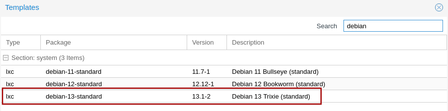
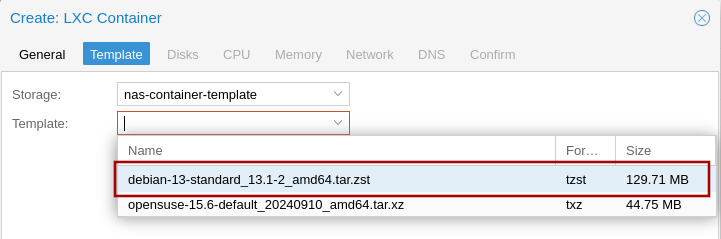
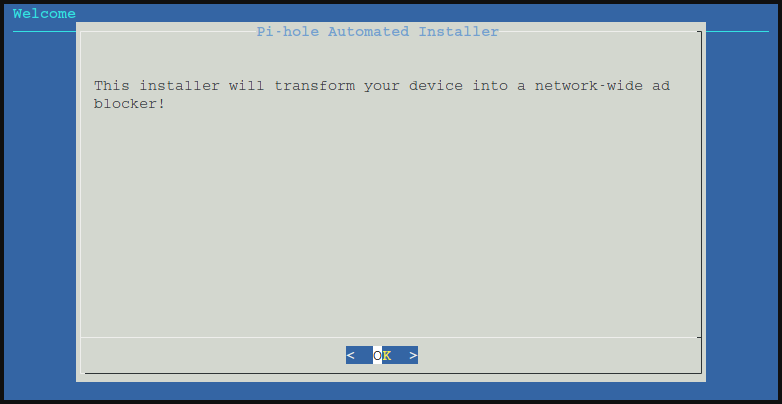
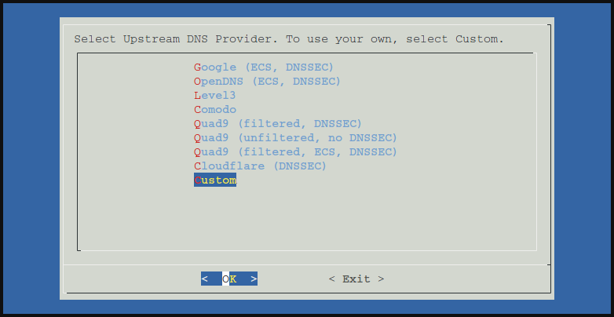
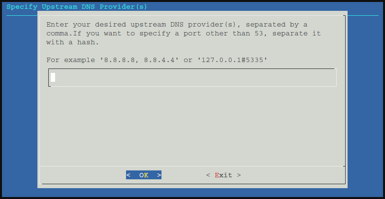
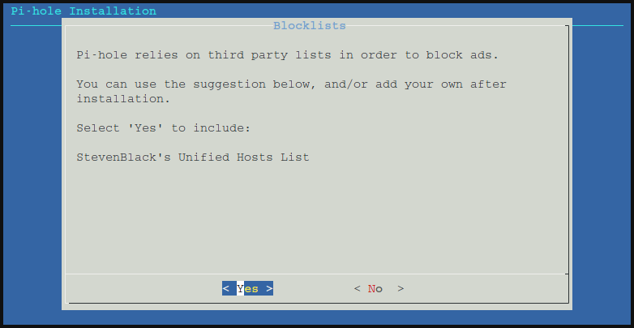
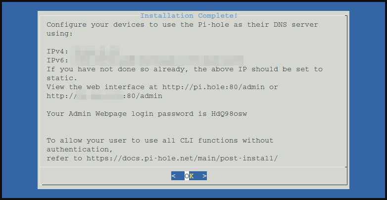
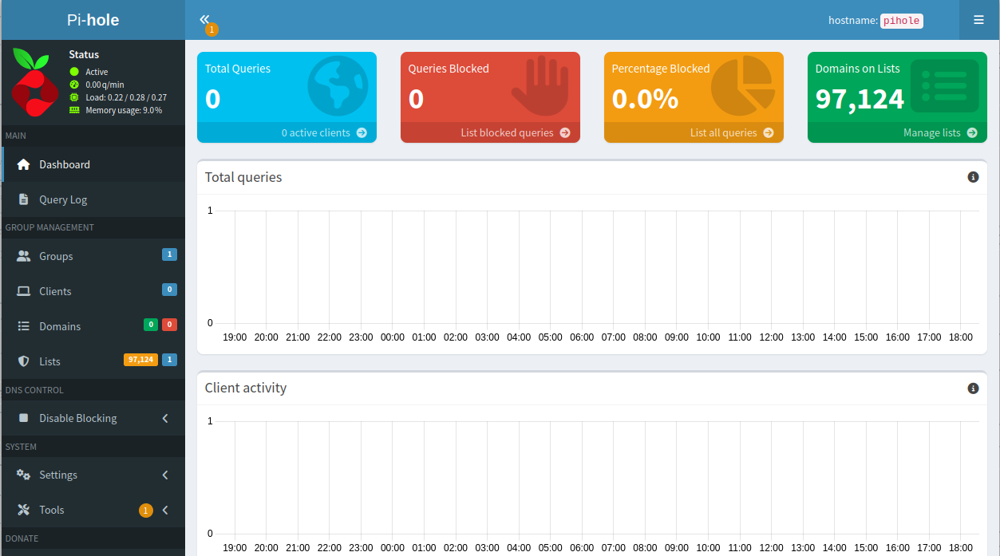

# Installing Pi-Hole in Proxmox LXC

Tested on Proxmox v8.4.

I'd recommend using Terraform to create and manage resources in Proxmox.
Although, creating a Pi-Hole by hand is quite simple if you follow this guide.

## Ensure Proxmox is up to date

Ensure that Proxmox is up to date.
If Proxmox is not up to date then there is a possibility that the creation of an LXC based on Debian Trixi will fail with the error:

```text
TASK ERROR: ... unsupported debian version '13.1'
```

## Create LXC

Download the Container Template for Debian 13 Trixi:



Use the `Create CT` button to create a new LXC container.

Give the LXC a sensible hostname, set the password and optionally set an SSH public key.

Use the Debian 13 template.



8GB of disk, 2 cores of CPU, 512 MB memory is fine.

Pi-Hole is a service. I recommend allocating a static IPv4 and IPv6 (it's 2025, you do have IPv6, yes?) address to services, but a static DHCP address is also a possibility.

Set the next DNS server for the LXC. The up-stream DNS servers for Pi-Hole will be set later during Pi-Hole's installation.

After the LXC has been created, I also needed to change the options for the console mode to `shell` in order to reliably access the console.


## Update the LXC base packages

Start the Pi-Hole LXC from Proxmox.

Login at the console command-line, either using the Proxmox console or via SSH.
The username will be `root` with the password or SSH key that was given when creating the LXC.

Update Debian's base packages:

```console
apt update && \
apt -y full-upgrade && \
reboot
```

## Install Pi-Hole

Login at the console command-line again.

Install Pi-Hole using their provided install script.

```console
apt install -y curl && \
curl -sSL https://install.pi-hole.net | bash
```

Note: it's your server running on your network, you need to be happy to run the script from the Internet.
Running random scripts from the Internet is bad.
You should inspect the script first, to ensure you are happy that the script doesn't present a security problem to you.

Step through the graphical installation.



Select the upstream DNS provider you want Pi-Hole to use.



If you have a custom DNS configuration it can be easily be configured.



You are probably coming to Pi-Hole to use the managed lists of add sites to block.



Select the logging levels that satisfy your requirements.

After the installation is complete you will be presented with some admin access details.



You can use the provided password, write it down - it won't be presented again.

But instead I suggest set the password yourself at the console command-line, using the `pihole setpassword` command.

```console
root@pihole:~# pihole setpassword
Enter New Password (Blank for no password):
Confirm Password:
  [✓] New password set
```

Still on the console command-line, use the `pihole -g` command to update the databases of hosts to block.

```console
root@pihole:~# pihole -g
  [✓] DNS resolution is available

  [i] Neutrino emissions detected...

  [✓] Preparing new gravity database
  [✓] Creating new gravity databases
  [✓] Pulling blocklist source list into range
  [i] Using libz compression

  [i] Target: https://raw.githubusercontent.com/StevenBlack/hosts/master/hosts
  [✓] Status: No changes detected
  [✓] Parsed 97124 exact domains and 0 ABP-style domains (blocking, ignored 1 non-domain entries)
      Sample of non-domain entries:
        - fe80::1%lo0

  [✓] Building tree
  [i] Number of gravity domains: 97124 (97124 unique domains)
  [i] Number of exact denied domains: 0
  [i] Number of regex denied filters: 0
  [i] Number of exact allowed domains: 0
  [i] Number of regex allowed filters: 0
  [✓] Optimizing database
  [✓] Swapping databases
  [✓] The old database remains available
  [✓] Cleaning up stray matter

  [✓] Done.
```

Now you can go to the admin dashboard web interface at the URL given above, login with the password you were given or set, and start to investigate.



## Update Pi-Hole

Login at the console command-line and use the `pihole -up` command.

```console
root@pihole:~# pihole -up
  [✓] Building dependency package pihole-meta.deb
  [✓] Installing Pi-hole dependency package

  [i] Checking for updates...
  [i] Pi-hole Core:	up to date
  [i] Web Interface:	up to date
  [i] FTL:		up to date

  [✓] Everything is up to date!
```
