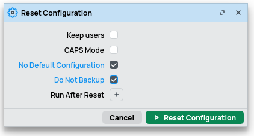

# Migrating from MikroTik L009UiGS to RB5009UG

I've had a MikroTik L009UiGS for a couple of years.

It's been incredibly stable, running the PPPoE session for my broadband and doing a lot of the routing and firewalling in my home.
But I'm not getting wire-speed routing between VLANs.

When my home broadband was upgraded from xDSL FTTC to FTTP I noticed I wasn't getting the full download speed.
This has spurred me into buying a MikroTik RB5009UG to replace the L009UiGS.

Comparing the specifications for the RB5009UG to the L009UiGS, the RB5009UG has twice the CPU cores, the cores are 64 bit, the cores can run at twice the speed, there's twice the RAM and 8 times the storage.
On top of that there's an 10Gbps SFP+ port I can use to connect to my 10Gbps network.

All I need to do is swap out the new RB5009UG for the old L009UiGS...

## Configuration

I could configure the two routers to run in parallel.
Have the PPPoE termination and default gateways on one router.
Then switch the PPPoE and default gateways to the other router.

but, honestly, is it worth it?
This is only a home network.
I can live with some down time.

So the simplest thing for me to do is to copy the configuring from the L009UiGS, change the management IP address and device identity, and upload it to the RB5009UG.

## Accessing the new device

I started by installing the latest version of [MikroTik Winbox][MikroTik Winbox] onto a laptop.

Once Winbox was running I connected the laptop to ethernet port 2 of the RB5009UG powered it up.
Winbox saw that the device was a neighbour and let me connect to it using the detected MAC address.

## Clearing the default configuration

When the RB5009UG arrived it had some default configuration.
Since I'm migrating the configuration from a fully configured L009UiGS I don't want any of the default configuration.

At the first connection from Winbox to the RB5009UG the default configuration popped-up an alert which had an option to 'revert' the configuration, to remove the default configuration.

I chose that option.

If I hadn't chosen that option I could have chosen to reset the configuration either by using the menu options ***System → Reset Configuration*** and checking ***No Default Configuration*** and ***Do Not backup***...



Or by using the terminal and running

```console
/system reset-configuration keep-users=yes no-defaults=yes skip-backup=yes
```

After the RB5009UG reboots it will be nice and clean, except for retaining the admin user.

### Enable IPv6

Keeping the RB5009UG plugged directly into my laptop is annoying.
I wanted to connect it discretely onto my network, in a way that would not interfere with anything else, and connect to it remotely.

I decided the simplest route would be for me to enable the RB5009UG to take-up an IPv6 address.
I enabled accepting Router Advertisements...

```console
/ipv6 settings set accept-router-advertisements=yes
```

... then I could see the IPv6 address that was selected.

```console
/ipv6 address print
```

### Add IPv6 route

```console
/ipv6/route/add dst-address=fd30::/64 gateway=fd30::1
```

## Copy the previous device configuration

Exporting and Importing the running configuration for

I have a regular backup procedure.
Currently I use a Python script, which calls SSH and SCP to create the export file and copy it to my backup location.

```console
/export terse show-sensitive file=config_export.rsc
```

### What isn't included in the configuration export

* certificates
* users and their passwords

## Edit the previous device configuration

As is good practice, I have an admin VLAN which is the only VLAN I can
The only significant changes I needed to make was to update the admin IP addresses.

## Enable device-mode settings

As described in the MikroTik wiki on [device mode][MikroTik Device Mode], the RB5009UG comes configured as a ***home*** device.
I want an ***advanced*** device, and also enable the ***container*** feature.

```console
system/device-mode/update mode=advanced container=yes
  update: turn off power or reboot by pressing reset or mode button in 5m00s to activate changes
-- [Q quit|D dump|C-z pause]
```

... tap the RESET button, and wait for the router to reboot.

## Apply the new device configuration

```console
/import import_config.rsc
```

## Clean up

```console
/ipv6/route/add dst-address=fd30::/64 gateway=fd30::1
/ipv6/route/remove numbers=0
/system/reboot
```

## References

This document is inspired by [this Redit post][Redit move config].

[Redit move config]: <https://www.reddit.com/r/mikrotik/comments/1dq4bck/how_to_properly_move_config_from_one_mikrotik/>

[MikroTik Winbox]: <https://mikrotik.com/download/winbox>

[MikroTik Device Mode]: <https://help.mikrotik.com/docs/x/CoCWBQ>
