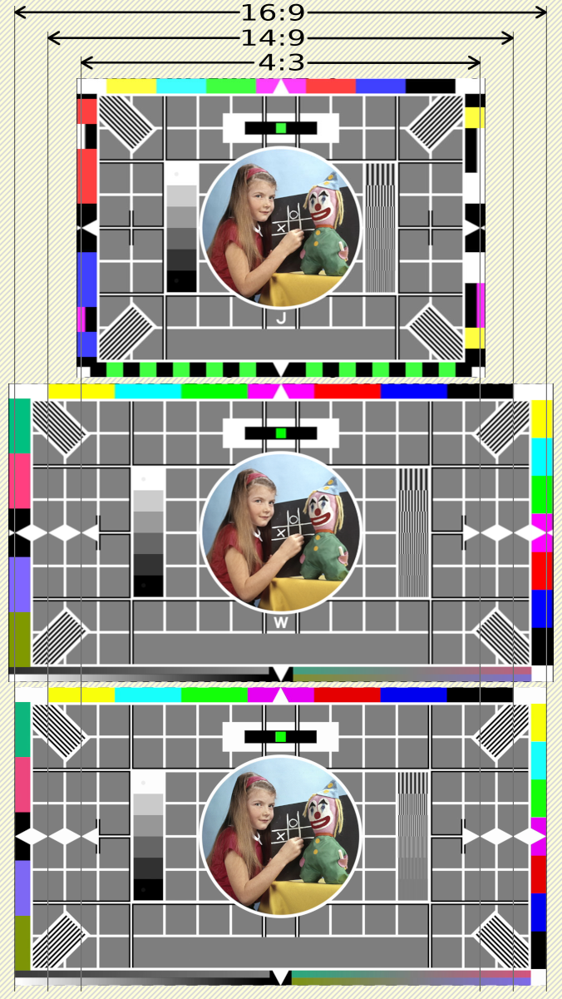

<!-- himslm01 custom-head.html-->

<!-- end himslm01 custom-head.html-->

# Broadcast TV - SD Aspect Ratios

All Standard Definition digital video broadcast video formats use anamorphic pixels. Be they 4:3 or 16:9 formats, be they 'PAL' or 'NTSC' formats, the pixels making up the image are anamorphic.

Most broadcast Standard Definition formats have an active picture area that is not the same size as the encoded picture area. Be they 4:3 or 16:9 formats, be they 'PAL' or 'NTSC' formats, there are probably extra pixels on the left and right of of the active picture, and and possibly lines missing at the top or bottom of the picture.

To understand why, we have to look at some analogue TV and digital TV specifications.

## Analogue active line length

### 625-line, 50 fields per second

In the analogue world of "PAL" TV there are 625 lines transmitted 25 times a second.

A single line is $ \dfrac{1}{25\times 625} = 0.000064 $ seconds, $ 64 $ micro-seconds ($ \mu s $), long.

Which matches the "Nominal line period" of $ 64 \mu s $ in table 1-1 of [ITU-R BT.470-6][ITU-R BT.470-6].

[ITU-R BT.470-6][ITU-R BT.470-6] table 1-1 also says the blanking period is $ 12 \mu s $.

Which leaves $ 52 \mu s $ for *active picture*, the rest is sync-pulse and back & front porch.

### 525-line, $ \frac{60}{1.001} $ fields per second

In the analogue world of "NTSC" there are 525 lines transmitted $ \frac{30}{1.001} $ times per second.

A single line is $ \dfrac{1}{29.97\times525} = 0.000063\overline{5} $ seconds, $ 63.\overline{5} \mu s $, long.

Which matches the "Nominal line period" of $ 63.5555 \mu s $ in table 1-1 of [ITU-R BT.470-6][ITU-R BT.470-6].

[ITU-R BT.470-6][ITU-R BT.470-6] table 1-1 also says the blanking period is $ 10.9 \mu s $.

Which leaves $ 52.6555 \mu s $ for *active picture*, the rest is sync-pulse and back & front porch.

## Analogue to digital conversion

For both 625 and 525 line systems analogue to digital conversion [ITU-R BT.601-7][ITU-R BT.601-7] says that the luminance sampling frequency is 13.5 Mega-Hertz (MHz).

We can confirm line lengths sampled at 13.5MHz by calculating how many samples there would be per total line length.

$ 13.5MHz \times 64 \mu s = 864 $ samples per total line for 625-line, 50 field per second systems.

$ 13.5MHz \times 63.\overline{5} \mu s = 858 $ samples per total line for 525-line, $ \frac{60}{1.001} $ field per second systems.

Those values match table 4 of [ITU-R BT.601-7][ITU-R BT.601-7]

To calculate the *active pixels* which correspond to the *active picture* of a line of video we calculated above, sampled at 13.5MHz:

$ 13.5MHz \times 52 \mu s = 702 $ *active pixels* per line for "PAL"/"SECAM"

$ 13.5MHz \times 52.6\overline{5} \mu s = 710.84 $ *active pixels* per line for "NTSC"

[ITU-R BT.601-7][ITU-R BT.601-7] states that the analogue to digital converters for both 625 and 525 line systems will encode 720 pixels per line. This standardises the analogue to digital conversion systems, and means that the whole *active picture* of each line of both systems could fit, with some padding at each end of the line.

## SD 576 line systems ("PAL" & "SECAM")

With "PAL", the centre 702 pixels of the 720 encoded pixels per line are the *active pixels*, the rest - 9 pixels at the start and 9 pixels at the end, are parts of the analogue back-porch and front-porch and must be cropped and discarded when preserving the aspect ratio of the video.

The *active pixels* may contain either 4:3 or 16:9 video.

## Anamorphic pixels

### SD 576 line 4:3

To calculate the square-pixel width of a 4:3 576 line video:

$ 576 \times \dfrac{4}{3} = 768 $ pixels wide.

That means the centre 702 *active pixels* need to be scaled up to 768 pixels to make square pixel 4:3.

Applying the same scaling ratio to the full sampled 720 pixels of complete line means:

$ \dfrac{720}{702} \times 576 \times \dfrac{4}{3} = 767.69 $ pixels wide.

Rounding to the nearest whole even number, we must scale the full sampled 720 pixels up to 788 pixels to make full frame square pixel 4:3 (to within 0.02%).

That results in the display aspect ratio of the full encoded "4:3" 720x576 picture being **197:144**.

### SD 576 line 16:9

To calculate the square-pixel width of a 16:9 576 line video:

$ 576 \times \dfrac{16}{9} = 1024 $ pixels wide.

That means the centre 702 *active pixels* need to be scaled up to 1024 pixels to make square pixel 16:9.

Applying the same scaling ratio to the full sampled 720 pixels of complete line means:

$ \dfrac{720}{702} \times 576 \times \dfrac{16}{9} = 1050.26 $ pixels wide.

Rounding to the nearest whole even number, we must scale the 720 pixels up to 1050 pixels to make full frame square pixel 16:9 (to within 0.02%) .

But, for reasons of ease of encoding, we normally round to the nearest whole number divisible by 8, which is 1048 pixels wide (accurate to within 0.2%)

That results in the display aspect ratio of the full encoded "16:9" 720x576 picture being **131:72**.

## Crop edges demonstration with BBC testcards

Compare the three testcards:

* 720x576 ("PAL") 4:3 SD - Testcard-J - top
* 720x576 ("PAL") 16:9 SD - Testcard-W - middle
* 1920x1080 16:9 - Testcard-HD - bottom

---
**_NOTE:_**

The picture area of both the 720x576 ("PAL") 4:3 SD (Testcard-J - top) and the 720x576 ("PAL") 16:9 SD (Testcard-W - middle) extends past the 4:3 and 16:9 lines.

This is because the *active picture* (up to the outer central diamond points) is the centre 702 pixels of the whole 720 pixel SD video line. The 'active' area is 4:3 or 16:9, the 'whole picture' area is wider than 4:3 or 16:9.

---
**_IMPORTANT:_**

When converting from SD video into square-pixel video the edges past the 4:3 or 16:9 lines must be cropped and discarded. Only the centre 702 pixels of the 720 pixel SD video line must be used.

When converting from square-pixel video into SD video the edges past the 4:3 or 16:9 lines must be added back. The square-pixel video must fill the centre 702 pixels of the 720 pixel SD video line, the rest is usually filled with black.

An approach when scaling 16:9 SD video is to maintain the (about) 131:72 display aspect ratio of the full line of the SD video, then crop the resulting video down to 16:9 discarding the left and right edges.

### Example scaling "PAL" SD 16:9 video to square pixels

"PAL" SD media starts as 576 lines of anamorphic pixels.

$ 576 \times \dfrac{16}{9} = 1024 $

Therefore square pixel 16:9 "PAL" SD media 1024x576

Scaling 16:9 SD media to square pixels you would scale 720x576 pixels to a display aspect ratio of 131:72.

$ 720 \times \dfrac{131}{72} = 1048 $

Therefore you first scale 720 to 1048 and preserve the 576 lines.

Now crop to the centre 1024x576 pixels from the 1048x576.
Start 12 pixels from the left, take 1024 pixels, and ignore the final 12 pixels on the right.

## References

* [ITU-R BT.470-6][ITU-R BT.470-6] "Conventional Television Systems" is the industry guide to analogue Standard Definition video.
* [ITU-R BT.601-7][ITU-R BT.601-7] "Studio encoding parameters of digital
television for standard 4:3 and wide-screen 16:9 aspect ratios" is the industry guide to digitizing analogue Standard Definition video.
* In the past the [BBC](https://www.bbc.co.uk/) published its TV commissioning guidelines, which included a page summarising the information above. The page was deleted from the BBC site in 2011 but remains available at [The Internet Archive](http://replay.waybackmachine.org/20100826080627/www.bbc.co.uk/commissioning/tvbranding/picturesize.shtml).
* In the past [Adobe](https://www.adobe.com/) realised they they'd been getting the aspect ration of Standard Definition media wrong. They published a page describing how they got it wrong all the way up before After Effects CS4. The page was deleted from Adobe's site in 2019 but remains available at [The Internet Archive](https://web.archive.org/web/20161009062035/http://help.adobe.com/en_US/AfterEffects/9.0/WS3878526689cb91655866c1103906c6dea-7f3aa.html).
* [Mike Afford](https://www.mikeafford.com/) wrote a blog post in 2009 describing the differences between Adobe After Effects CS3 and CS4 after Adobe fixed their Standard Definition aspect ratio issue [PAL D1/DV Widescreen square pixel settings in After Effects (CS4 vs CS3)](https://www.mikeafford.com/blog/pal-d1-dv-widescreen-square-pixel-settings-in-after-effects-cs4-vs-cs3/).

[ITU-R BT.470-6]: https://www.itu.int/dms_pubrec/itu-r/rec/bt/r-rec-bt.470-6-199811-s!!pdf-e.pdf "Conventional Television Systems"
[ITU-R BT.601-7]: https://www.itu.int/dms_pubrec/itu-r/rec/bt/r-rec-bt.601-7-201103-i!!pdf-e.pdf "Studio encoding parameters of digital
television for standard 4:3 and wide-screen 16:9 aspect ratios"
