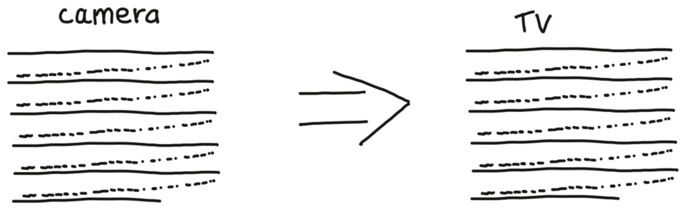

# Broadcast Media 101

This section is intended as a practical guide to video and audio with a specific focus on aspects pertinent to broadcast situations.

## About the author

I have worked in television and radio for more than 35 years and also worked in software development for 15 years - the two time periods partly overlap.

I started my journey into broadcast at a Hospital Radio station, which was a great place to learn. 4 years later I was working at the BBC as a Video Tape operator. Through my career at the BBC I have operated all of the available types of [videotape](https://en.wikipedia.org/wiki/Videotape) machines (2-inch, 1-inch, ¾-inch U-Matic, ½-inch BetaCam formats, 8mm DV formats, ...)and [telecine](https://en.wikipedia.org/wiki/Telecine) machines (Rank-Cintel mark 2 and mark 3), I have mixed audio in radio studios and dubbing theatres, I have edited video in linear tape-to-tape suites and non-linear computer suites (Avid, Quantel, FCP 7 & X, DaVinci Resolve, ...).

Live broadcast is great, but I have also developed software (Java, Python, Perl, ...), architected and build Internet Services, and architected software systems involving broadcast systems integrations and broadcast media generation and transcoding.

Through my training at the BBC I have an in-depth knowledge of television and radio from their analogue origins into today's digital world, and I understand the compromises which were taken in the analogue world and in the transition from analogue into the digital world.

Let me take you on a learning journey...

## Glossary & Conventions

In this document I will use some shorthand notation of common terms.

| Term | Meaning |
| --- | --- |
| 29.97 | Used to refer to the decimal number that is 30,000 ÷ 1001 |
| 59.94 | Used to refer to the decimal number that is 60,000 ÷ 1001 |
| HD | High Definition broadcast media - between 960 and 1920 pixels wide, between 720 and 1080 lines high, 25 or 29.97 interlaced or progressive segmented frame frames per second, or 50 or 59.94 progressive frames per second.
| i/25 | Same as 'PAL' and 'SECAM', used to refer to the 25 frames per second version of SD or HD.|
| i/30 | Same as 'NTSC', Used to refer to the 29.97 frames per second version of SD or HD. |
| NTSC | The analogue 29.97 frames per second `National Television System Committee` system used in The United States of America and other places.|
| 'NTSC' | Used to refer to the 29.97 frames per second version of SD or HD.  This term has quotes around it to indicate that I really do not mean the analogue `National Television System Committee` system.|
| PAL | The analogue 25 frames per second`Phase Alternating Line` broadcast television system used in the UK up to the analogue switch-off in 2012. |
| 'PAL' | Used to refer to the 25 frames per second version of SD or HD.  This term has quotes around it to indicate that I really do not mean the analogue `Phase Alternating Line` system.
| SECAM | The analogue `Séquentiel couleur à mémoire` system used in Europe until the analogue switch-off. |
| 'SECAM' | Used to refer to the 25 frames per second version of SD or HD.  This term has quotes around it to indicate that I really do not mean the analogue `Séquentiel couleur à mémoire` system.
| SD | Standard Definition broadcast media - 720 pixels wide or less, between 460 and 608 lines high, 25 or 29.97 frames per second, interlaced or progressive segmented frame.
| UGC | User Generated Content. In general, any content which originated outside of the broadcast environment; including content that submitted from the general public or downloaded from public services. |

## Analogue Television history

### Analogue television is not analogue movie film

It is important to remember that television and film are fundamentally different in the method that they capture pictures.

In analogue moving film capture, a very fast moving shutter opens to expose a whole frame of film for a period of time (often for around a $ 1 \over 20 $ th of a second). The frame of film captures everything in the camera's view, then the shutter closes and the next frame film is dragged into position. Repeat 24 times a second and you have a blockbuster film on your hands.

Analogue television is very different.

In analogue television only one tiny spot of light is captured in the camera at a time.

A spot detecting brightness and colour travels very quickly from left-to-right across the frame of the camera, and more slowly from top-to-bottom of the frame. For live analogue TV, as the tiny spot detecting brightness and colour is travelling across the camera's frame the brightness and colour of that spot is being broadcast and received in televisions. On the television, exactly in sync with the camera, a tiny spot illuminates the screen to replicate the detected brightness and colour to the viewers. Only that tiny spot is detected, broadcast, and displayed at any instant in time.

In PAL and SECAM analogue TV, the tiny spot travels at a speed which would allow it to scans from left-to-right 625 times per $ 1 \over 25 $ th of a second. Because of how analogue electronics works, there are significant amounts of time that the scanning spot is travelling back from the right-to-left to prepare for a new line to be scanned, and for the spot to travel back from the bottom-to-top to prepare for the next picture to be started.

These times equate to 18.75% of each line plus 8% of each frame where the scanning spot is travelling back to a start position. That means that the time taken for nearly $ 1 \over 5 $ th of each line and 50 lines cannot be used to capture picture information.

In NTSC analogue TV the timings are similar - with nearly $ 1 \over 5 $ th of each line and 40 lines cannot be used to capture picture information.

## Flashing displays

In usual analogue movie film capture, one complete frame is taken 24 times a second. When the finished film is displayed in a movie theatre, each frame needs to be displayed - so light is shone through the frame of film, then a shutter blocks the light, the frame is moved, and the light is shone through the film again. But, that 24 times per second the flicker rate looks horrible. So instead light is shone through the same frame twice before the film is moved to the next frame, doubling the flicker rate up to 48 times per second, which is above the rate that the average human eye can detect significant flicker.

For analogue television the same problem exists. Televisions cannot flicker 25 times per second, they need to flicker at twice that rate. This was achieved by scanning and displaying every other line in each pass. The analogue camera scans, and the analogue TV displays, lines 1, 3, 5, 7, ... in one $ 1 \over 50 $ th of a second, then scans and displays lines 2, 4, 6, 8, ... in the next $ 1 \over 50 $ th of a second. Human brains cope with that trick, the resolution reduction are made-up in the brain, and the flicker is not usually noticeable.

## Specifications of analogue PAL

To get into a little bit of maths - each line of analogue PAL (and SECAM) is 64 microseconds ( $ 1 \div 25 \div 625 = 0.000064 $ ) of which 52 microseconds can be used for picture information, the rest is used for "flyback" to get the scanning point back to the start. In analogue video that "flyback" time is used to send timing pulses which ensure TVs are scanning in sync with the camera.
