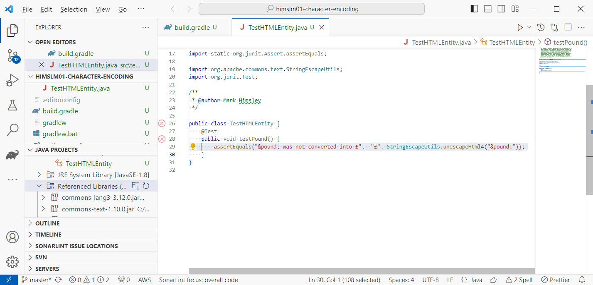
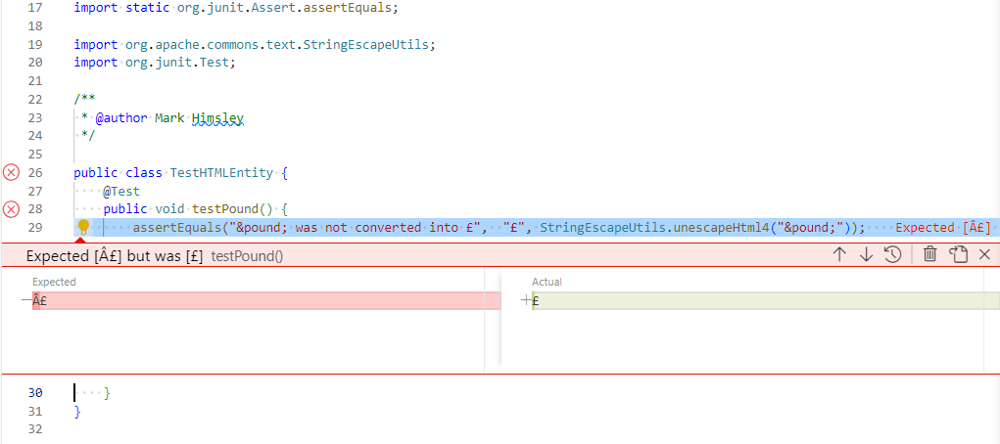
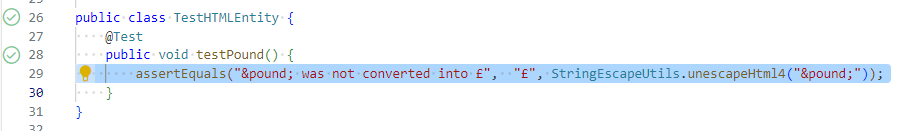

# UTF-8 Character Encoding in Java on Windows

## The problem

Below I will use a common library which converts HTML entities into their UTF-8 character, and I will create a unit test to confirm that the library is doing the correct job.

I am only going to focus on the HTML entity `&pound;`, which should be converted into the character `£`

I'm going to use Microsoft Visual Studio Code running on Windows to edit the source code.

I have created a simple project in VSCode on Windows, and ensured that I am saving the source files as UTF-8 with LF only line endings - just as I might on other platforms.



The code in `TestHTMLEntity.java` is very simple - just one assert in a test which is using a method in Apache's `commons-text` library to test the conversion of the HTML entity into its character representation.

```java
import static org.junit.Assert.assertEquals;

import org.apache.commons.text.StringEscapeUtils;
import org.junit.Test;

public class TestHTMLEntity {
    @Test
    public void testPound() {
        assertEquals("&pound; was not converted into £",  "£", StringEscapeUtils.unescapeHtml4("&pound;"));
    }
}
```

There is a simple `gradle.build` file to collect the dependencies and select Java 8. Note that this venerable version of Java is not going to cause the problem I'm observing.

```java
plugins {
    id 'application'
}

repositories {
    mavenLocal()
    mavenCentral()
}

java {
    toolchain {
        languageVersion.set(JavaLanguageVersion.of(8))
    }
}

wrapper {
    distributionType = Wrapper.DistributionType.ALL
    gradleVersion = '8.4'
}

dependencies {
    implementation("org.apache.commons:commons-text:1.10.0")

    testImplementation("junit:junit:4.12")
}
```

If I run the test in VSCode it fails - which is unexpected.



Looking carefully at the text in the "Actual" column you can see that the conversion from the HTML entity `&pound;` to the character `£` worked. The failure is because the text in the "Expected" is the two characters `£` not the single `£` character I had in the source code.

## Why the two characters `£` ?

In the [Windows Code Page 1252](https://en.wikipedia.org/wiki/Windows-1252) the `Â` character is composed of the hex byte `0xc2`, and the `£` character is composed of the hex byte`0xa3`.

In [UTF-8](https://www.charset.org/utf-8) `£` character is composed of two hex bytes `0xc2 0xa3` - the same hex bytes as the two characters `£`.

### On Windows the Java compiler assumes Java source code text is encoded using Windows Code Page 1252

The Java compiler `javac` has assumed that: since it is compiling on Windows, the source code will be in Windows Code Page 1252. But VSCode is saving the source code in UTF-8.

#### How to fix this

There are several simple ways to fix this problem. Only one of them is the correct fix.

##### Save the source file in Windows Code Page 1252

Implementing this bad fix would be terrible for any collaborators working on devices other than Windows - and useless if you had pulled the code from a Git repository where all of the files are stored in UTF-8.

##### Change the source code

Implementing this bad fix would result in you having to use unicode entities in your source code - using `\u00A3` instead of the `£` character in the source code.

```java
    @Test
    public void testPound() {
        assertEquals("&pound; was not converted into \u00A3",  "\u00A3", StringEscapeUtils.unescapeHtml4("&pound;"));
    }
```

I should hope that it's clear why changing your source code so that every UTF-8 character that is not directly mapped into the Windows Code Page 1252 is written as its unicode entity is a bad thing.

##### Configure Gradle

The correct fix is to tell Gradle to tell the Java Compiler `javac` to ignore it's assumption that the source code is in Windows Code Page 1252, and instead tell the Java Compiler `javac` that the source code is in UTF-8.

The documentation for [`javac`](https://docs.oracle.com/javase/8/docs/technotes/tools/windows/javac.html#BHCGAJDC) includes this section:

> **-encoding *encoding***
>
> Sets the source file encoding name, such as EUC-JP and UTF-8. If the `-encoding` option is not specified, then the platform default converter is used.

To add the option `-encoding UTF-8` to the [`javac`](https://docs.oracle.com/javase/8/docs/technotes/tools/windows/javac.html#BHCGAJDC) command line I will add this small section into the `build.gradle` file:

```java
tasks.withType(JavaCompile) {
    options.encoding = 'UTF-8'
}
```

Saving the `build.gradle` file and re-running the test that failed, it now passes.


