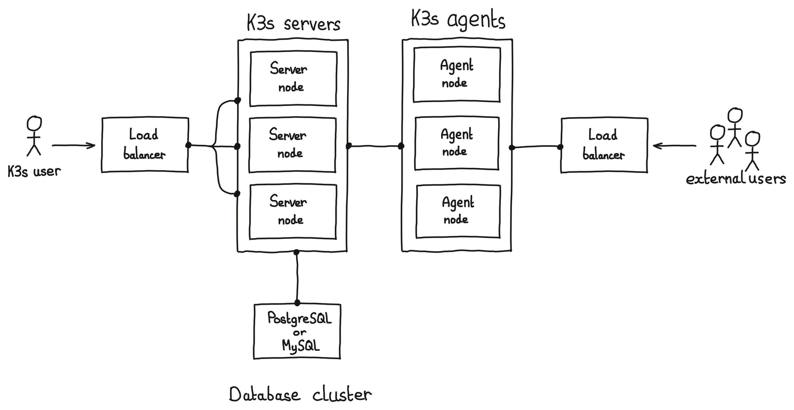
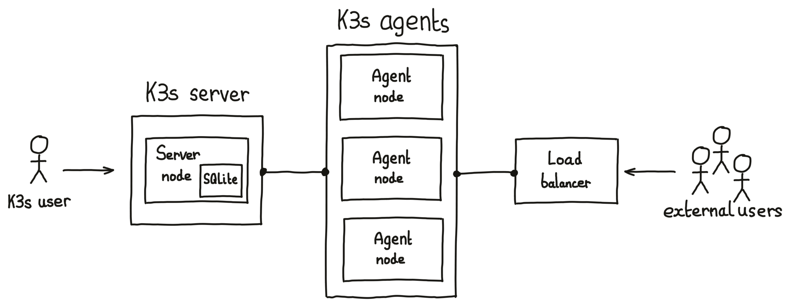

# K3s cluster database options

Classic [Kubernetes](https://kubernetes.io/) clusters store their cluster data in a clustered [etcd](https://etcd.io/) datastore.

The [K3s](https://k3s.io/) distribution of Kubernetes includes other methods of storing its cluster data.

* external etcd cluster (the classic Kubernetes method)
* internal etcd cluster (etcd built into the server nodes)
* external SQL database (each of the server nodes connects to the external database)
* internal SQLite database (only one server node can exist in the cluster)

Lets examine the pros and cons of the options.

## External etcd cluster

The classic and well supported method of storing Kubernetes cluster data. The best practice is for the etcd cluster to run on independent hosts who's sole job is running the etc datastore.

The etcd cluster should consist of an odd number of nodes, with three nodes being the minimum for high availability.

Care should be taken to regularly snapshot the data stored in the etcd cluster, and restores of the data should be practised, to a separate cluster, to ensure the procedure is understood.

This is a good option for a highly available Kubernetes cluster so long as you have the skills to support the etcd cluster. In order to run an HA Kubernetes cluster you will need at least three hosts for the etcd cluster, two hosts for Kubernetes server nodes, and a highly available load-balancing system for the Kubernetes control-plane API.

## Internal etcd cluster

K3s has the etcd code compiled in, so k3s can [create an etcd cluster](https://docs.k3s.io/datastore/ha-embedded) when the cluster is first initialised.

K3s will create the etcd datastore on every server node. Since etcd should consist of an odd number of nodes, with three nodes being the minimum for high availability, there needs to be the same number of Kubernetes server nodes.

Regularly snapshotting and restoring of the data stored in the etcd cluster should be observed. Some snapshotting is automatically enabled in K3s. The [CLI commands](https://docs.k3s.io/cli/etcd-snapshot) to backup and restore the internal etcd database are builtin to K3s.

This a good option for a highly available Kubernetes cluster where there is limited knowledge for setting up an etcd cluster.

It is also possible to create a Kubernetes cluster with less resources - fewer hosts are needed to run the HA cluster (only three K3s server nodes with internal etcd, compared to the five nodes recommended a K3s cluster with external etc). Although, it is recommended that heavy workloads are not run on the server nodes, which might mean the Kubernetes cluster requires more worker (agent) nodes.

This is a good option for development and test clusters. Self-contained HA K3s clusters are very quick to install, and can be created and destroyed rapidly through provisioning tools like [Ansible](https://www.ansible.com/). An example Ansible repo is [available](https://github.com/k3s-io/k3s-ansible), although it is not well maintained.

## External SQL database

K3s can [create an HA Kubernetes cluster with the cluster date stored in an external SQL database](https://docs.k3s.io/datastore/ha). K3s includes a light-weight shim which replicates the etcd API but stores the data in an external SQL database. To Kubernetes the shim looks just like an etcd server.

A Highly Available Kubernetes cluster will require a Highly Available PostgreSQL, MariaDB, or MySQL database with a single HA host address.

This a good option for a Highly Available Kubernetes cluster where Database Administrators can provide and manage the Highly Available databases-as-a-service for the Kubernetes cluster.

## Internal SQLite database

The etcd API shim in K3s can also use SQLite as the SQL database.

The SQLite database file is stored at `/var/lib/rancher/k3s/server/db/`. [Snapshotting and restoring](https://docs.k3s.io/datastore/backup-restore#backup-and-restore-with-sqlite) the SQLite database is based on copying or restoring the contents of that folder.

This is not an option for a Highly Available Kubernetes cluster. Only one server node is possible with this option, which cannot create an HA cluster.

This is a good option for development and test clusters, especially where resources are constrained.

Do not let the idea of only having one server node and the cluster data being stored in SQLite put you off. Worker nodes can be added to the cluster and the cluster it can run for many years without incident.
