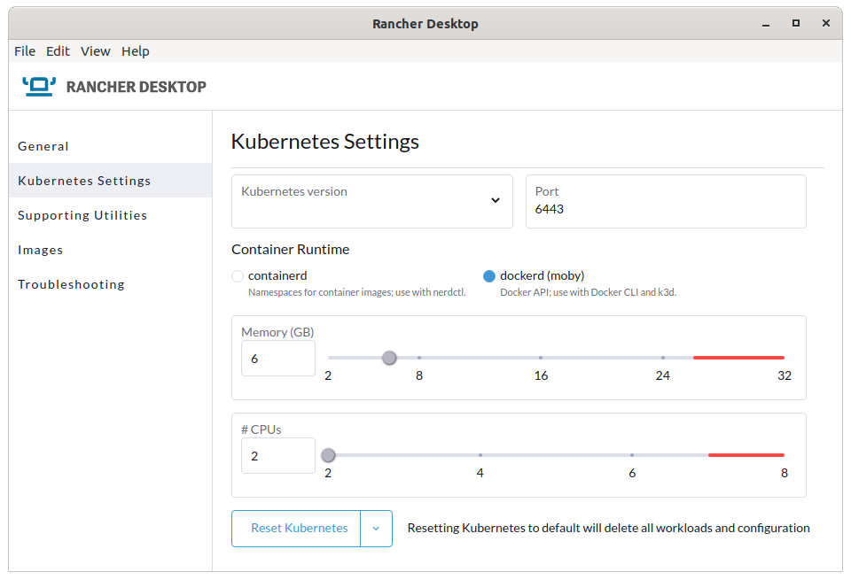
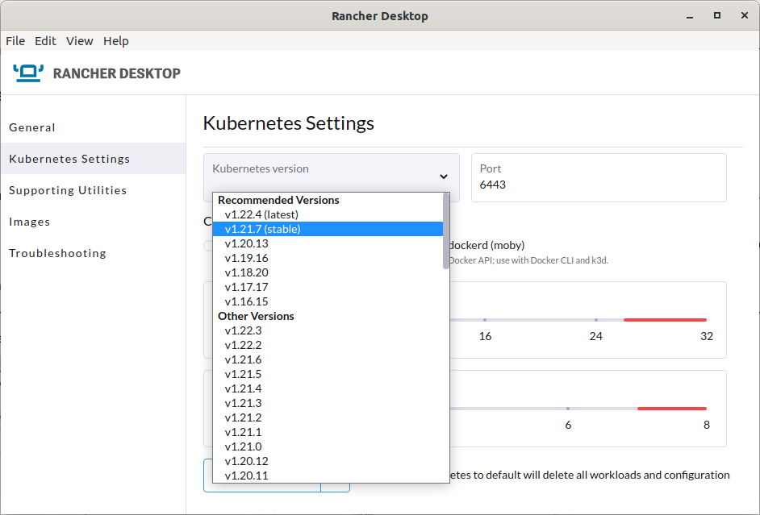
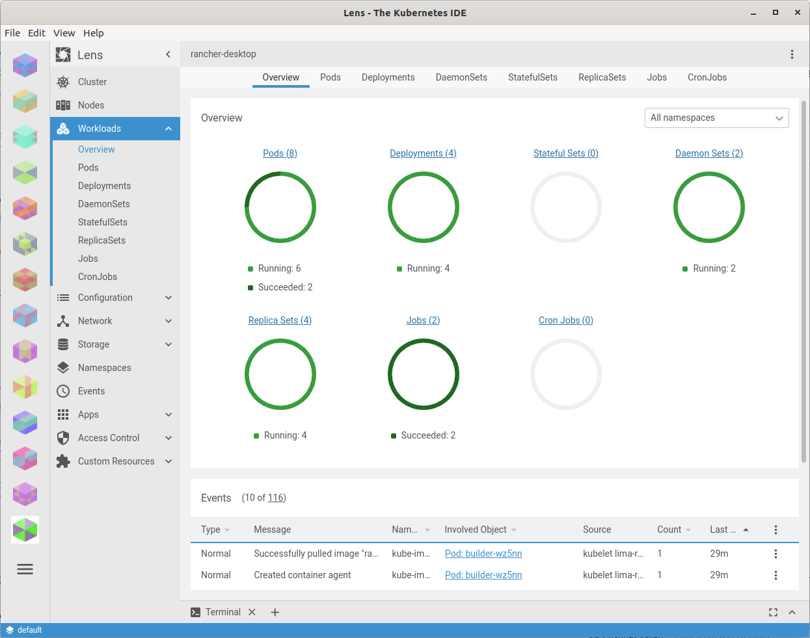

# Rancher Desktop

## Mac, Windows, and Linux

As of January 2022 with the release of version v1.0 you can install `Rancher Desktop` on Windows, Mac and Linux. `Rancher Desktop` runs up a VM on all three, which allows `Rancher Desktop`'s kubernetes install to be isolated from your desktop.

I have installed v1.0.1 onto a Mac, by downloading the .dmg from [https://github.com/rancher-sandbox/rancher-desktop/releases](https://github.com/rancher-sandbox/rancher-desktop/releases) (plus-open the Assets and download Rancher.Desktop-1.0.1.x86_64.dmg).

I have also installed on GNU Linux Ubuntu 20.04 desktop, by adding their repo - but you could download the .deb - details here [https://software.opensuse.org/download.html?project=isv%3ARancher%3Astable&package=rancher-desktop](https://software.opensuse.org/download.html?project=isv%3ARancher%3Astable&package=rancher-desktop).

### Running

Run the `Rancher Desktop` application from the "Start" or "Applications" menus / Dock, and you will see the `Rancher Desktop` application and a friendly horned computer logo in the notification area .

You can select how much RAM and how many CPU cores to assign to the virtual machine, and you can pick which version of Kubernetes to install.

At this point you have a single node kubernetes cluster called rancher-desktop running on your local machine. You can interact with it with the standard kubernetes tools, including `kubectl`, `helm` - which `Rancher Desktop` kindly installed for you:

    $ kubectl get nodes --context rancher-desktop
    NAME                   STATUS   ROLES                          AGE   VERSION
    lima-rancher-desktop   Ready    builder,control-plane,master   35m   v1.21.5+k3s2

... and also other tools like Lens [https://k8slens.dev/](https://k8slens.dev/).

## Work in Progress

`Rancher Desktop` is a work in progress - there are a few rough edges and the documentation is a little lacking, but there are some fun workarounds and an active Slack channel.

The User Interface is missing the ability to set some important settings in the container runtime, which are expected to de developed over the next few months.

But I believe `Rancher Desktop` is already capable of replacing `Docker Desktop` - if you poke it with some workarounds.

### Containerd or Dockerd (moby)

`Rancher Desktop` was originally developed to use `containerd` as its container runtime. The documentation of workarounds is mostly for `containerd`. But there are issues when building container images using `containerd` and it's command line tool `nerdctl`.

You are supposed to be able to substitute `nerdctl` for `docker` (or create an alias) - the CLI commands are supposed to be identical, but there are a few issues. The most notable issues using `nerdctl` are building images `FROM` local images and copying using `COPY --from` a local image. These commands  do not work. [https://github.com/containerd/nerdctl/issues/434](https://github.com/containerd/nerdctl/issues/434)

Because of that issue, `Rancher Desktop` can now be switched to use `dockerd` as the container runtime (okay - it's actually `containerd` underneath `dockerd`, but `dockerd` is in control). This means you can use the `docker` command line tool (which also comes bundled with `Rancher Desktop`) and building images works as expected.

### Get a shell into the Rancher Desktop VM

Since Rancher Desktop spins up a VM in which it runs `containerd` or `dockerd`, using Qemu or a WSL instance on Windows, there might be occasions when it would be useful to access the VM - for investigating issues, for instance.

On a Mac you do this - it's all one command and the quotes around the paths is important due to there being spaces in them:

    LIMA_HOME="$HOME/Library/Application Support/rancher-desktop/lima" \
      "/Applications/Rancher Desktop.app/Contents/Resources/resources/darwin/lima/bin/limactl" \
      shell 0

On Linux you do this - it's all one command:

      LIMA_HOME="$HOME/.local/share/rancher-desktop/lima" \
        /opt/rancher-desktop/resources/resources/linux/lima/bin/limactl \
        shell 0

## Problems

### Configuring the Rancher Desktop container runtime to pull images from private repositories is difficult

I am sure you are all aware of the need to edit `dockerd`'s daemon.json file to include `insecure-registries` and `registry-mirrors`. In `Docker Desktop` you can edit that in the GUI (here's an image from the Internet).

In `Rancher Desktop`'s GUI you cannot currently edit that file (or the similar file that has edited when you are using `containerd` as the container runtime). But there is a workaround.

#### Inside a VM

Since `Rancher Desktop` (and `Docker Desktop`) both run the container runtime inside a VM, all configuration for the container runtime is inside a VM. It's hard to edit files in the VM, which is why `Docker Desktop` includes that ability in its GUI.

The configuration file for `dockerd` is `/etc/docker/daemon.json` inside the VM. The configuration file for setting `containerd`'s registries in Rancher Desktop is `/etc/rancher/k3s/registries.yaml` inside the VM.

It is possible to inject commands into the boot-up sequence of the Rancher Desktop VM, so we can make the configuration file for dockerd and containerd at VM start, and the container runtime will pickup the settings when it starts inside the VM.

#### Workaround

You can define both `/etc/rancher/k3s/registries.yaml` and `/etc/docker/daemon.json` in one go by creating `override.yaml` in the following location:

- Linux: `$HOME/.local/share/rancher-desktop/lima/_config/override.yaml`
- Mac: `$HOME/Library/Application Support/rancher-desktop/lima/_config/override.yaml`

Here's an example override.yaml

    provision:
      - mode: system
        script: |
        #!/bin/sh
        set -eux
        mkdir -p /etc/rancher/k3s
        cat <<EOF >/etc/rancher/k3s/registries.yaml
        mirrors:
          docker.io:
            endpoint:
              - "http://nexus.lan:8084"
          nexus.lan:
            endpoint:
              - "http://nexus.lan:8084"
        EOF
        mkdir -p /etc/docker
        cat <<EOF >/etc/docker/daemon.json
        {
            "insecure-registries" : ["nexus.lan:8084"],
            "registry-mirrors": ["http://nexus.lan:8084"],
            "experimental": true
        }
        EOF

On Windows I think you just edit /etc/docker/daemon.json in the WSL image and restart Rancher Desktop.

See [https://github.com/rancher-sandbox/rancher-desktop/issues/721](https://github.com/rancher-sandbox/rancher-desktop/issues/721).

### Nerdctl cannot build images FROM local images or using --copy-from from local images

See [https://github.com/containerd/nerdctl/issues/434](https://github.com/containerd/nerdctl/issues/434).

#### Workaround

Switch the container runtime from `containerd` to `dockerd (moby)`.

### Rancher Desktop binds to ports 80 and 443

When Rancher Desktop is started it binds to ports 80 and 443, which may conflict with other software you may be running. This is because Rancher Desktop runs [k3s](http://k3s.io/) as the Kubernetes implementation, and by default it runs Træfik as the ingress controller.

#### Workaround

Uninstall Træfik:

    helm uninstall traefik --namespace kube-system
    helm uninstall traefik-crd --namespace kube-system
    kubectl delete helmcharts traefik --namespace kube-system
    kubectl delete helmcharts traefik-crd --namespace kube-system
